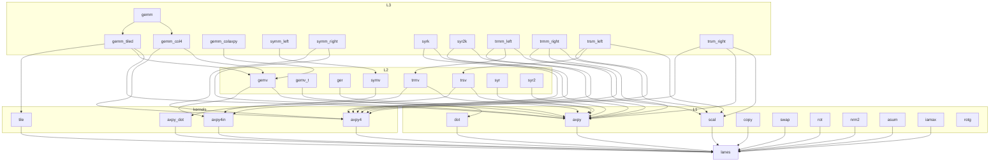

# src/ — the call graph

Which functions call which functions. One node per routine, covering
both types: the f64 and f32 layers have identical call structure by
construction, so `gemv → axpy` means both `dgemv → daxpy` and
`sgemv → saxpy`.

Reading notes, kept out of the graph:

- `gemm` is a size dispatcher over `gemm_tiled` and `gemm_col4`;
  `gemm_colaxpy` is the plain reference shape, kept for bit checks.
  `tile` is gemm's private register-tile micro-kernel (it lives in
  the gemm files, not `kernels.rs`); `axpy_dot` stands for both the
  1- and 4-column fused symv kernels.
- `rotg` calls nothing (guarded scalar, no arrays); copy/swap/rot/
  nrm2/asum/iamax have no in-crate callers — consumers call them
  directly.
- Not drawn: the small type-free helpers `check_mat`,
  `{d,s}scale_y`, `{d,s}sym_at`, used across their levels.
- WHY each edge has the shape it has (fan-out/fan-in/fused/tile) is
  the crate README's taxonomy and tables; the measured consequences
  are `../bench/README.md`.

One property worth knowing: improvements flow up the arrows — when
the tuning campaign gave `dot` four accumulators, `gemv_t` got
1.3–1.7× faster untouched (two-draw runner verdict, docs step 7).
