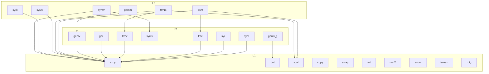

# src/ — the call graph

Which routines call which routines — the crate README's 23 routines,
nothing below that level; 24 nodes because gemv's transpose twin is
drawn separately (it depends on dot where gemv depends on axpy —
they share one file and one count everywhere else). Covers both
types (the f64 and f32 layers have identical structure).

Notes:

- Below the routines sits shared plumbing that is deliberately not in
  the graph: the private SIMD kernels (`kernels.rs` — the blocked hot
  loops several routines share) and the lane types (`lanes.rs`).
  gemm's three internal loop shapes and its size dispatcher likewise
  live inside the gemm files.
- `symv` has no outgoing arrows: its fused kernel replaced the
  axpy+dot composition it used to be.
- `rotg` and copy/swap/rot/nrm2/asum/iamax are leaves — nothing in
  the crate calls them; consumers do.
