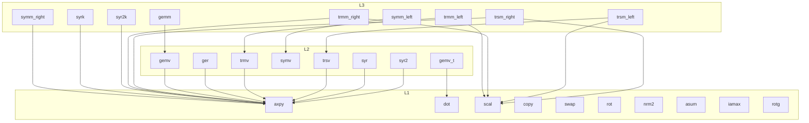

# src/ — routine naming and the call graph

Which operations call which operations. **One node = one
mathematically distinct operation** — 27 of them: the 23 netlib-named
routines (= the files per type) with the flag variants split out,
because a transposed product or a side swap is a different result
(gemv_t; symm/trmm/trsm left and right). gemm's internal loop shapes
are NOT extra nodes — they produce bit-identical results. This graph
covers the f64 and f32 layers, which have identical structure; the
c64 layer's differences are listed below it.

Notes:

- Below the operations sits shared plumbing, deliberately not in the
  graph: the private SIMD kernels (`kernels.rs` — blocked hot loops
  several operations share), the lane types (`lanes.rs`), gemm's
  internal shapes and dispatcher (inside the gemm files), and the
  small helpers (`check_mat`, `{d,s}scale_y`, `{d,s}sym_at`).
- `symv` has no outgoing arrows: its fused kernel replaced the
  axpy+dot composition it used to be.
- `rotg` and copy/swap/rot/nrm2/asum/iamax are leaves — nothing in
  the crate calls them; consumers do.

## The complex layers (z- and c-routines) — same graph, renamed nodes

The two complex layers (c64 z-prefixed, c32 c-prefixed — identical
structure) are the same picture with node substitutions — **26
routines / 31 operations** each (counting convention: crate README):

- *Splits*: `dot` → `dotu` + `dotc` (unconjugated/conjugated are
  different results); `ger` → `geru` + `gerc`; `gemv` gains a third
  form `gemv_c` (y ← αAᴴx, one `dotc` per column) beside `gemv` and
  `gemv_t`; `scal` gains the real-α `dscal` form.
- *Renames*: the symmetric family becomes Hermitian — `symv` → `hemv`
  (fused, no outgoing arrows, same as symv), `syr`/`syr2` →
  `her`/`her2`, `symm` → `hemm`, `syrk` → `herk`, `syr2k` → `her2k` —
  with the same edges as their real twins.
- *Delegations, not nodes*: copy/swap/rot/the real-α scal/nrm2/asum
  are one-line calls to the tuned same-precision real routines on the
  interleaved 2n-real view (`c64.rs`/`c32.rs`) — they inherit the
  real stream's speed, guards, and determinism rather than
  duplicating the loops (c64: zcopy/zswap/zdrot/zdscal/dznrm2/dzasum;
  c32: ccopy/cswap/csrot/csscal/scnrm2/scasum).
- `rot` is the real-c,s form (`zdrot`/`csrot`); `zrotg`/`crotg`
  generate the complex Givens (c real, s complex) — the complex-s
  application (`zrot`) has no consumer yet.

## Routine naming — the netlib convention (applies to L1/, L2/, L3/)

One file per BLAS routine per number type, named exactly as the
reference BLAS names them — the layout of the netlib source tree.
The file name is the function it exports: `daxpy.rs` exports
`pub fn daxpy`.

### The type prefix

The first letter encodes the number type, matching the columns of the
tables in the crate README:

| prefix | type | example |
|---|---|---|
| `d` | f64 (double) | `daxpy`, `dgemm` |
| `s` | f32 (single) | `saxpy`, `sgemm` |
| `z` | c64 (double complex) | `zaxpy`, `zgemm` — built 2026-07-19 |
| `c` | c32 (single complex) | `caxpy`, `cgemm` — built 2026-07-19 |

The index routines put `i` first and the type second: `idamax` /
`isamax` / `izamax` / `icamax` (index of the largest element — |x|
for real, |re|+|im| for complex). The complex routines that return a
real carry both letters, exactly as reference BLAS spells them:
`dznrm2`/`scnrm2`, `dzasum`/`scasum`; and the real-scalar/
real-rotation forms keep reference names too: `zdscal`/`csscal`
(real α), `zdrot`/`csrot` (real c, s).

### Where we deviate from reference BLAS — deliberately, per routine

The names are netlib's; the signatures are ours (documented per file):

- **No trans/side/uplo character arguments.** Variants that reference
  BLAS folds into flag parameters are separate functions:
  `dgemv`/`dgemv_t` (plus `zgemv_c` for the conjugate transpose),
  `dsymm_left`/`dsymm_right`, `dtrmm_left`/`dtrmm_right`,
  `dtrsm_left`/`dtrsm_right` (and their z twins). Triangle and
  unit-diagonal selection stay as `bool` parameters where the loop
  structure is shared (`upper`, `unit`).
- **Unit stride only.** Callers pass contiguous column slices with a
  column stride per matrix — no `incx`/`incy` (strided access defeats
  streaming and no consumer wants it).
- **`drotg`/`srotg` return a `Givens` struct** (c, s, r) instead of
  writing through pointers, and omit the classic `z` reconstruction
  output — no consumer wants it. `zrotg` likewise returns a `ZGivens`
  (real c, complex s, complex r).
- **Tuned-variant exports.** Where a routine ships raced alternates,
  they carry a suffix: `dgemm_colaxpy` (the plain reference shape),
  `dgemm_tiled`, `dgemm_col4`, `dgemm_packed` — `dgemm` itself is the
  size dispatcher. Every type carries a `*gemm_packed` shape since the
  2026-07-20 race; in z/c it is the packed complex register tile.

Everything else about a routine — what it computes, its rounding
contract, which tuned loop shape it ships and why — lives in its own
file's module docs. The per-level composition rules are in each
level's `mod.rs`; who-calls-whom is the graph above.
