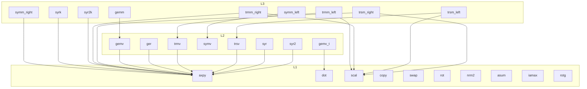

# src/ — the call graph

Which operations call which operations. **One node = one
mathematically distinct operation** — 27 of them: the 23 netlib-named
routines (= the files per type) with the flag variants split out,
because a transposed product or a side swap is a different result
(gemv_t; symm/trmm/trsm left and right). gemm's internal loop shapes
are NOT extra nodes — they produce bit-identical results. Covers both
types (the f64 and f32 layers have identical structure).

Notes:

- Below the operations sits shared plumbing, deliberately not in the
  graph: the private SIMD kernels (`kernels.rs` — blocked hot loops
  several operations share), the lane types (`lanes.rs`), gemm's
  internal shapes and dispatcher (inside the gemm files), and the
  small helpers (`check_mat`, `{d,s}scale_y`, `{d,s}sym_at`).
- `symv` has no outgoing arrows: its fused kernel replaced the
  axpy+dot composition it used to be.
- `rotg` and copy/swap/rot/nrm2/asum/iamax are leaves — nothing in
  the crate calls them; consumers do.
