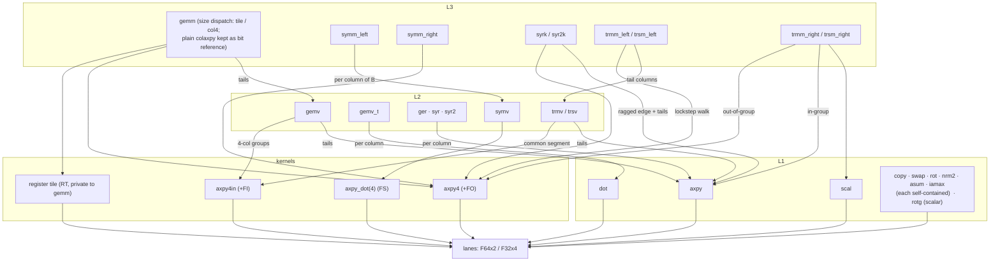

# src/ — the dependency map

One file per BLAS routine per type, netlib naming (convention:
`L1/README.md`). The layer is a strict one-way composition — every
edge points from caller to callee; no cycles, no sideways calls
within a level.

**One node = one routine family, both types.** The f64 (d-) and f32
(s-) routines have identical edge sets by construction — same files,
same calls, with the s-side running on the s-kernels and `F32x4` —
so the map treats them as one. (If a future type ever deviates
structurally, it gets its own edges here.)

Edge labels are the crate README's shorthand (+FO fan-out, +FI
fan-in, FS fused symv pass, RT register tile). Grouped nodes share
their edges: `syrk / syr2k` both stream via axpy4 with ragged edges
on axpy; `trmm_left / trsm_left` both do the lockstep walk (trsm's
tails go to trsv); `trmm_right / trsm_right` differ only in trsm's
reciprocal scal; `ger · syr · syr2` are all plain axpy-per-column;
symm_right's tail columns use axpy.

Not drawn: the shared helpers — `L2::check_mat` (storage validation,
type-free), `L2::{d,s}scale_y` (BLAS β=0 = hard zero-fill),
`L3::{d,s}sym_at` (stored-triangle lookup) — are leaf utilities used
across their levels.

Why composition is load-bearing and not just tidy: when the tuning
campaign gave `dot` four accumulators, `gemv_t` — a loop of dot calls
— got 1.3–1.7× faster without being touched (two-draw runner verdict,
docs step 7). Improvements flow up the arrows, in both types at once.

The composition is structural, not sacred: any edge may be replaced
by a tuned kernel when a race on the reference machines says so (the
record of every such decision: `../../docs/blas-ab-2026-07.md`).
