# src/ — the dependency map

One file per BLAS routine per type, netlib naming (convention:
`L1/README.md`). The layer is a strict one-way composition — every
edge below points from caller to callee; there are no cycles and no
sideways calls within a level. The map shows the f64 routines; every
s-routine mirrors its d-twin's edges exactly (onto the s-kernels and
`F32x4`).

```mermaid
graph TD
  subgraph L3
    dgemm["dgemm (dispatch)"]
    dgemm_tiled
    dgemm_col4
    dgemm_colaxpy["dgemm_colaxpy (bit reference)"]
    dsymm_left
    dsymm_right
    dsyrk
    dsyr2k
    dtrmm_left
    dtrmm_right
    dtrsm_left
    dtrsm_right
  end

  subgraph L2
    dgemv
    dgemv_t
    dger
    dsymv
    dtrmv
    dtrsv
    dsyr["dsyr / dsyr2"]
  end

  subgraph L1
    daxpy
    ddot
    dscal
    drotg["drotg (G — scalar)"]
    dl1rest["dcopy · dswap · drot · dnrm2 · dasum · idamax"]
  end

  subgraph kernels
    daxpy4["daxpy4 (+FO)"]
    daxpy4in["daxpy4in (+FI)"]
    daxpy_dot["daxpy_dot(4) (FS)"]
    tile["tile_8x4 / tile_4x4 (RT)"]
  end

  lanes["lanes: F64x2 / F32x4"]

  dgemm -->|"A ≤ threshold"| dgemm_tiled
  dgemm -->|"A > threshold"| dgemm_col4
  dgemm_tiled --> tile
  dgemm_tiled -->|tails| dgemv
  dgemm_col4 --> daxpy4
  dgemm_col4 -->|tails| dgemv
  dgemm_colaxpy -->|per column| dgemv

  dsymm_left -->|per column of B| dsymv
  dsymm_right --> daxpy4
  dsymm_right -->|tails| daxpy
  dsyrk --> daxpy4
  dsyrk -->|ragged edge + tails| daxpy
  dsyr2k --> daxpy4
  dsyr2k -->|ragged edge + tails| daxpy

  dtrmm_left -->|lockstep walk| daxpy4
  dtrmm_left -->|tail columns| dtrmv
  dtrsm_left -->|lockstep walk| daxpy4
  dtrsm_left -->|tail columns| dtrsv
  dtrmm_right -->|out-of-group| daxpy4
  dtrmm_right -->|in-group| daxpy
  dtrsm_right -->|out-of-group| daxpy4
  dtrsm_right -->|in-group| daxpy
  dtrmm_right --> dscal
  dtrsm_right --> dscal

  dgemv -->|4-col groups| daxpy4in
  dgemv -->|tails| daxpy
  dgemv_t -->|per column| ddot
  dger -->|per column| daxpy
  dsymv --> daxpy_dot
  dtrmv -->|common segment| daxpy4in
  dtrmv -->|tails| daxpy
  dtrsv -->|common segment| daxpy4in
  dtrsv -->|tails| daxpy
  dsyr -->|per stored segment| daxpy

  daxpy --> lanes
  ddot --> lanes
  dscal --> lanes
  dl1rest --> lanes
  daxpy4 --> lanes
  daxpy4in --> lanes
  daxpy_dot --> lanes
  tile --> lanes
```

Edge-label codes are the crate README's shorthand (+FO fan-out, +FI
fan-in, FS fused symv pass, RT register tile). The L1 routines are
each a self-contained stream over `lanes` — no L1 routine calls
another; `drotg` is the scalar exception and touches nothing.

Not drawn, by definition: `tile_8x4`/`tile_4x4` live inside
`dgemm.rs`/`sgemm.rs` (private micro-kernels, listed here because
they are the one tuned shape not in `kernels.rs`); the shared helpers
`L2::check_mat` (storage validation, type-free),
`L2::dscale_y`/`sscale_y` (BLAS β=0 = hard zero-fill), and
`L3::dsym_at`/`ssym_at` (stored-triangle lookup) are leaf utilities
used across their levels.

Why composition is load-bearing and not just tidy: when the tuning
campaign gave `ddot` four accumulators, `dgemv_t` — a loop of ddot
calls — got 1.3–1.7× faster without being touched (two-draw runner
verdict, docs step 7). Improvements flow up the arrows.

The composition is structural, not sacred: any edge may be replaced
by a tuned kernel when a race on the reference machines says so (the
record of every such decision: `../../docs/blas-ab-2026-07.md`).
